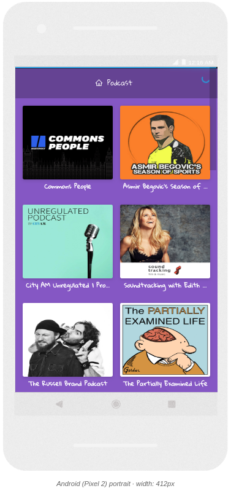
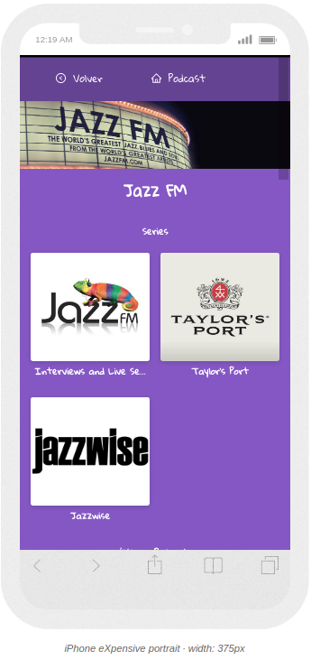
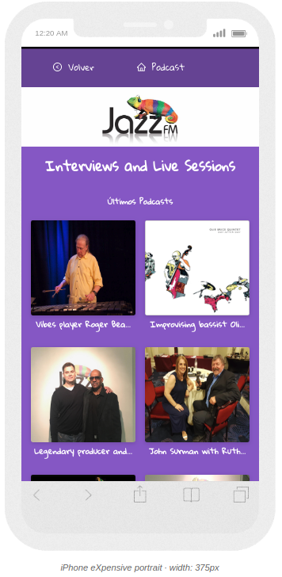
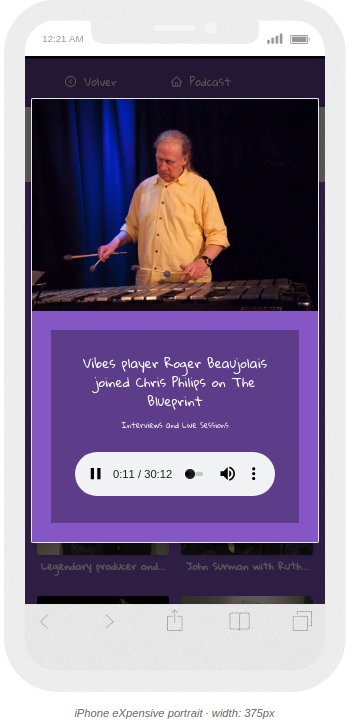
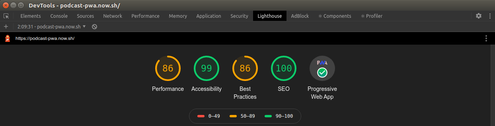

# First application with Next js

Podcast app integrated with AudioBoom API to learn Next js

# Run demo here

[Test my web app in this link!](https://nextjs.surfacerobin.now.sh/)

# Test my PWA (Progressive Web App) (Last Updated)

[Test my PWA in this link!](https://podcast-pwa.now.sh/)

# ¿How it works?

Require Node js 10

- `yarn` to install all dependencies.
- `yarn dev` to start development environment.
- `yarn build && yarn start` to start production environment

## License

MIT
